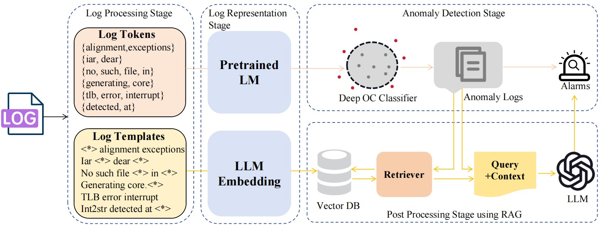

# Leveraging RAG-Enhanced Large Language Model for Semi-Supervised Log Anomaly Detection (ISSRE-2024)
[](https://doi.org/10.5281/zenodo.13372812)



This is the basic implementation of our submission in ISSRE 2024: Leveraging RAG-Enhanced Large Language Model for Semi-Supervised Log Anomaly Detection 

## Description

Log-based anomaly detection is critical in monitoring the operations of information systems and in the realtime reporting of system failures. Utilizing deep learning-based  log anomaly detection methods facilitates effective detection of  anomalies within logs. However, existing methods are greatly  dependent on log parsers, and parsing errors can considerably  affect downstream anomaly detection tasks. Additionally, methods that predict the next log event in a sequence are susceptible  to the instability of sequences and the emergence of unseen logs  as systems evolve, resulting in a higher false positive rate. In this  paper, we put forward LogRAG, a semi-supervised log anomaly  detection framework based on retrieval-augmented generation  (RAG). This framework conducts phased detection using both  Log Tokens and Log Templates to mitigate the impact of log  parsing errors. It also utilizes a single-class classifier to model the  normal behavior of the system, thereby circumventing the effects  of unstable sequences. Finally, it employs large language model  (LLM) empowered by RAG to reevaluate detected anomalous  logs, thereby improving accuracy. LogRAG demonstrates a 15%  improvement in F1 Score on the BGL dataset and a 60%  improvement on the Spirit dataset when compared to the previous  best semi-supervised learning algorithm.

## **Project Structure**

```jsx
LogRAG
├── .gitignore
├── README.md
├── config.yaml # config file
├── dataset  # train and test file
├── main.py # mian method
├── postprocess # post processing stage using RAG 
├── prelogad # anomaly detection stage
├── pretrained # pretrained language model
├── output # results
├── requirements.txt
└── utils
```

## Dataset

We will use the BGL and Spirit datasets for our experiments, which you can find in [LogHub]( https://github.com/logpai/loghub) or [LogADEmpirical](https://github.com/LogIntelligence/LogADEmpirical/tree/dev)


| **Dataset**  | **Size** | **# Logs** | **# Anomalies** | **Anomaly Ratio** |
|:-------------|:---------|:-----------|:----------------|:------------------|
| BGL          | 743 MB   | 4,747,963  | 348,460         | 7.34 %            |
| Spirit       | 1.4 GB   | 5,000,000  | 764,500         | 15.29%            |


The raw logs need to be parsed to get a structured log. Here, we use BGL.log_structured.csv and Spirit.log_structured.csv as the [Drain](https://github.com/logpai/logparser/tree/main/logparser/Drain) parsed data

## Reproducibility Instructions

### Environment Setup

**Requirements:**

- Python 3
- NVIDIA GPU + CUDA cuDNN
- PyTorch 2.3.0

The required packages are listed in requirements.txt. Install:

`pip install -r requirements.txt`

### Getting Started

You need to follow these steps to **completely** run `LogRAG` (Let's take an example of using LogRAG on the BGL-Example dataset)

**Step1: set api-key and get pretrained language model**

1. get pretrained language model from [BigLog](https://github.com/LogAIBox/BigLog), and put the model file into the  ./pretrained 
2. get chatgpt api-key for LogRAG-ChatGPT and LLM Embedding, we get from [here](https://www.closeai-asia.com/dashboard/)
- As for LogRAG-ChatGPT, you need to set the **api-key** value  in configs.yaml
- As for LogRAG-Mistral, you need first download [mistralai/Mistral-7B-Instruct-v0.1](https://huggingface.co/mistralai/Mistral-7B-Instruct-v0.1) from huggingface

**Step2: set config parameters**

```jsx
is_train: True # train deepsvdd
is_rag: True # use post processing stage
dataset_name: BGL
train_ratio: 0.8
window_size: 200 
window_time: 1800 # 30 minutes

# dataset and model paths
log_structed_path: ./dataset/BGL/bgl-example.log_structured.csv
encoder_path: ./pretrained

# openai key, you can get from :https://www.closeai-asia.com
api_key: PUT_YOUR_OWN_API_KEY_HERE 
api_base: https://api.openai-proxy.org/v1

llm_name: gpt-3.5-turbo
# llm_name: mistralai/Mistral-7B-Instruct-v0.1 # from huggingface

# deepsvdd parameters
normal_class: 0
is_pretrain: False
optimizer_name: adam
lr: 0.0001
n_epochs: 150
lr_milestones: [50]
batch_size: 40960
weight_decay: 0.0005
device: cuda:0
n_jobs_dataloader: 0

# rag parameters
threshold: 0.8
topk: 5
prompt: prompt5
persist_directory: ./output/ragdb-bgl

```

You can adjust configs parameters to verify the effect of LogRAG under different experimental conditions. The main fields are explained as follows:

- **is_train:** Whether to train the DeepOC module, this should be set to True for the first run or when switching conditions
- **is_rag:** Whether the RAG post-processing module is enabled or not, if False, the experimental results are only the results detected by DeepOC
- **window_size:** This fixes the window size
- **window_time:** This is a fixed amount of time in seconds

**Step3: let’s go !**

Download the dataset and the desired model, and then adjust the configs parameters to what you want, then:

`python main.py` 

and you will find the results in outpout/runtime.log ！
